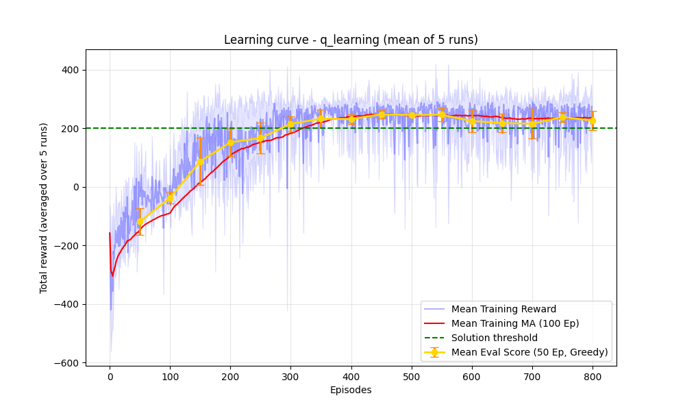
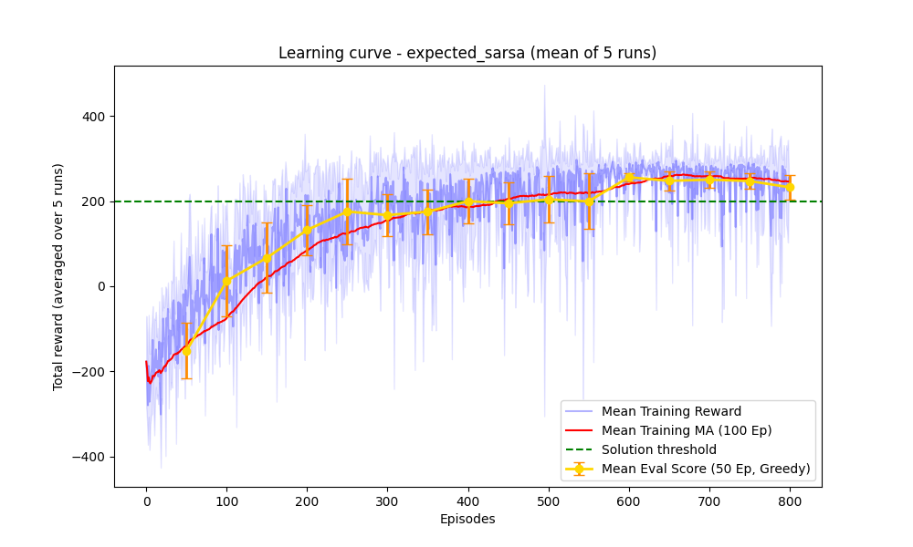

# Lunar Lender
This repository contains the code of the final (Capstone) project of the *Reinforcement Learning Specialization* offered by the University of Alberta through Coursera.

**[Work in Progress]**: the project is currently being refined and the README is being updated. The code is fully functional, but the results are still being analyzed.

## Overview
The project implements a complete RL system to solve the [LunarLander-v3](https://gymnasium.farama.org/environments/box2d/lunar_lander/) environment from OpenAI Gymnasium. The agent is trained using three different algorithms: Q-Learning, SARSA, and Expected SARSA. The code is structured to allow easy experimentation with different hyperparameters and algorithms.

## Installation
The project is developed using:
- `python=3.12`
- `torch=2.11`
- `gymnasium=1.2`

To install the required dependencies, run:
```
pip install -r requirements.txt
```

## Repository Structure
```
├── config/
│   └── config.yaml          <- Default configuration file for training
├── src/
│   ├── agent.py             <- Implementation of the RL agent and neural network
│   ├── train.py             <- Training loop and evaluation logic
│   └── utils.py             <- Utility functions for plotting, logging, and configuration handling
├── main.py                  <- Main script to run training and evaluation
├── [other files]
```

## Key features
The training is performed over multiple independent runs to average out the results and provide a more robust evaluation of the agent's performance. Action selection is implemented using an softmax policy, and a double-network strategy is used for more stable learning. The target network is updated with a Polyak averaging (EMA) strategy. The reward is smoothed using a moving average to visualize the learning curve more clearly. An evaluation phase is included at regular intervals during training, using a pure greedy policy to assess the agent's performance without exploration noise.

## Results
Both Q-Learning and Expected SARSA show a steady improvement in performance, surpassing the solution threshold of 200. The learning curves show a clear upward trend, indicating that the agent is successfully learning to maximize rewards over time. The evaluation results confirm that the trained agents are able to achieve high rewards in the LunarLander environment.

**Q-Learning** 

**Expected SARSA** 