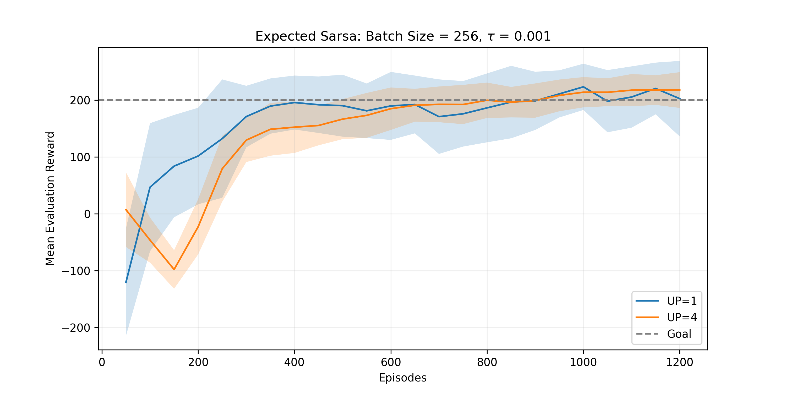
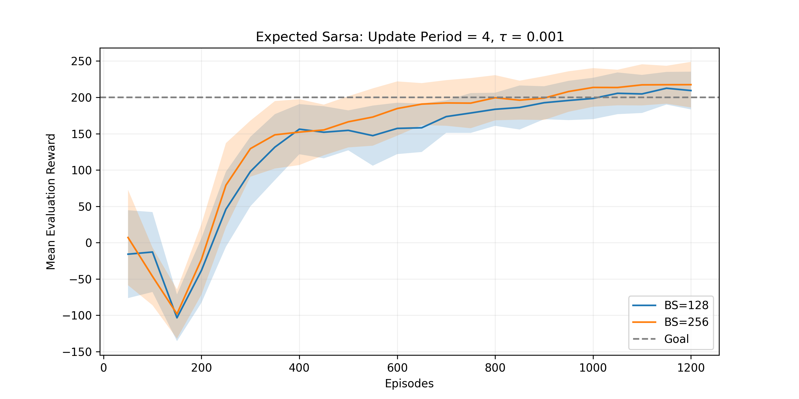
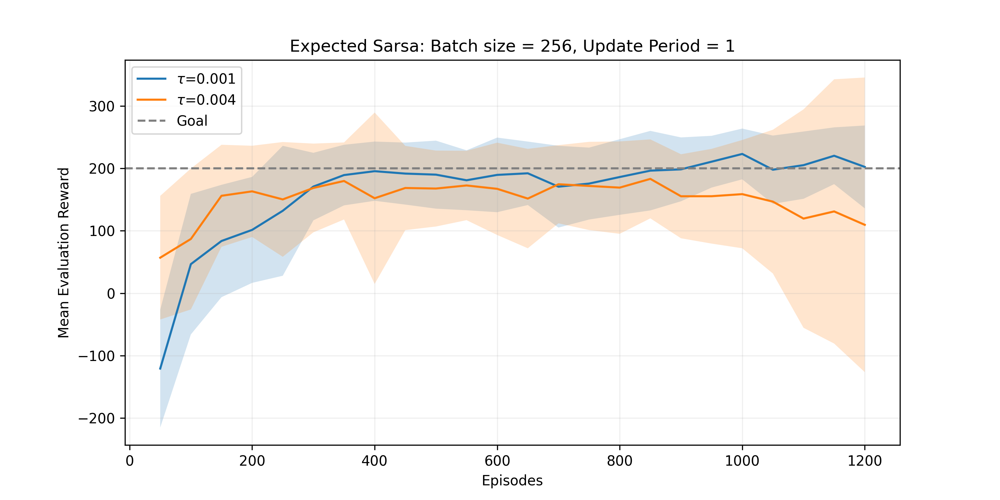
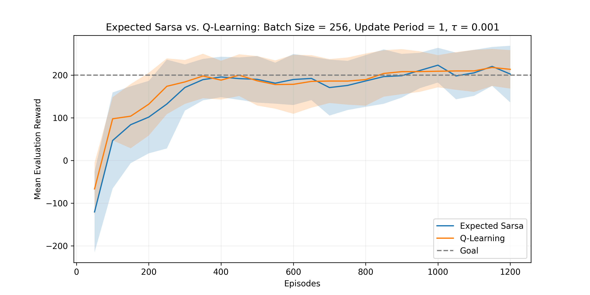

# Empirical Analysis of Deep RL Algorithms for Action Control in Continuous State Spaces

**[Coming Soon]**: the repository now contains the complete codebase and study only for action-value methods. I will soon be adding a similar study for policy-gradient algorithms, including a variant for continuous action spaces.

## Abstract
This repository presents an empirical study on the training dynamics and hyperparameter sensitivity of Value-Based Deep Reinforcement Learning algorithms, specifically **Double Q-Learning** and **Double Expected Sarsa**, in environments featuring continuous state spaces and discrete action spaces ([LunarLander-v3](https://gymnasium.farama.org/environments/box2d/lunar_lander/)). 

The core focus of this work is a rigorous statistical evaluation (averaged over 30 independent random seeds per configuration) analyzing how **Batch Size**, **Target Network Update Period**, and **Soft Update rates ($\tau$)** interact to stabilize gradients and mitigate late-stage *catastrophic forgetting*.

*Note: This research serves as an extension and complete overhaul of the final Capstone project of the Reinforcement Learning Specialization course (University of Alberta, through Coursera).*

## Installation
The project is developed using:
- `python=3.12`
- `torch=2.11`
- `gymnasium=1.2`

To install the required dependencies, run:
```
pip install -r requirements.txt
```

## Methodology & Experimental Setup
The project evaluates Q-Learning and Expected Sarsa, using a ReLU-activated 2-layer Multi-Layer Perceptron (MLP) to approximate the action-value function. The training objective is minimized via the smooth L1 (Huber) loss to provide robust bounds against high TD-error outliers. Action selection uses a temperature-decayed softmax policy.

To ensure **statistical significance and reproducibility**, the experimental framework strictly adheres to the following protocol:
- **Duration**: 1200 episodes of agent-environment interaction per run.
- **Evaluation**: The learned policy is evaluated every 50 episodes using a greedy (deterministic) strategy to isolate algorithmic capability from exploration noise.
- **Multiple Experiments**: Every single configuration is trained over **30 independent runs**. All learning curves and final metrics denote the Mean and Standard Deviation across these seeds.
- **Stable Solved Episode**: A configuration is considered "solved" at episode *E* only if the Evaluation Mean Reward strictly exceeds the environment threshold (200) at *E* and maintains that performance until the end of the budget without future collapse.

### Ablation Study Variables
Advanced stabilization techniques (*Double Learning* and *Delayed Target Networks* via EMA) were implemented. The ablation study measures the algorithms' sensitivity over:
- **Batch size** $\in$ `{128, 256}`
- **Update period** (target network delay steps) $\in$ `{1, 4}`
- **EMA decay factor ($\tau$)** $\in$ `{1e-3, 4e-3}`

## Results
The table below reports the **asymptotic performance** (the absolute *Final Evaluation Score* averaged between episodes 1150 and 1200, thus referring to the last 100 episodes) and the **sample efficiency** (*Stable Solved Episode*) for the full ablation matrix.

| Algorithm | Batch Size | Update Period | Tau ($\tau$) | Final Eval Mean Reward (± std) | Stable Solved Episode |
|:--|:--:|:--:|:--:|:--:|:--:|
| Expected Sarsa | 128 | 1 | 0.001 | 201.31 ± 59.06 | N/A |
| Expected Sarsa | 128 | 4 | 0.001 | 210.98 ± 24.37 | 1050 |
| Expected Sarsa | 256 | 1 | 0.001 | 211.27 ± 57.60 | 1100 |
| Expected Sarsa | 256 | 4 | 0.001 | **217.45 ± 28.87** | 950 |
| Expected Sarsa | 256 | 1 | 0.004 | 120.30 ± 224.45 | N/A |
| Expected Sarsa | 256 | 4 | 0.004 | 200.45 ± 67.61 | 1150 |
| Q-Learning | 128 | 1 | 0.001 | 208.95 ± 55.69 | 1150 |
| Q-Learning | 128 | 4 | 0.001 | 205.52 ± 23.46 | 1150 |
| Q-Learning | 256 | 1 | 0.001 | 215.59 ± 44.34 | **850** |
| Q-Learning | 256 | 4 | 0.001 | 217.26 ± 23.07 | 950 |

## Discussion & Key Findings

**1. The stabilizing effect of delayed target updates (update period)**  
Continuously mapping the main network to the target network every single episode (`UP=1`) induces critical asymptotic instability, causing late-stage gradient variance (notice the wide standard deviations: $\pm 57.60$ for Expected Sarsa and $\pm 55.69$ for Q-Learning). Introducing a discrete step delay (`UP = 4`) acts as a powerful regularizer against the moving-target problem, reducing standard deviation by 50%.



**2. Reward increase via larger batch sizes**  
The ablation study reveals that increasing the batch size strictly dictates the absolute asymptotic mean. For any given algorithm and fixed $\tau$ and update period, shifting from `BS=128` to `BS=256` elevates the final evaluation reward convergence plateau. Concurrently, pairing a large batch size (`BS=256`, shifting the mean up) with a delayed update period (`UP=4`, shrinking the variance) creates the optimal stable condition.



**3. The re-emergence of moving target due to fast updates ($\tau$)**  
The study highlights that pairing frequent updates (`UP=1`) with a faster EMA tracking rate (`tau = 0.004`) causes catastrophic forgetting. As seen in the worst-case run (`BS=256, UP=1, tau=0.004`), the policy completely degrades to a mean of `120.30` with extreme variance ($\pm 224.45$), confirming that temporal decoupling of the targets is strictly necessary for stable optimization.



**4. Context-dependent sample efficiency (Q-Learning vs. Expected Sarsa)**  
The assumption of one algorithm strictly dominating the other in sample efficiency does not hold; rather, they exhibit distinct hyperparameter sensitivities. Q-Learning's aggressive off-policy updates allowed it to achieve the fastest absolute convergence (episode 850) under high-variance conditions (`BS=256, UP=1, tau=0.001`). However, with smaller batch sizes (`BS=128, UP=4, tau=0.001`), Expected Sarsa proved more resilient, stabilizing 100 episodes earlier than Q-Learning (1050 vs. 1150). Ultimately, under fully optimized conditions (`BS=256, UP=4, tau=0.001`), both algorithms converged identically at episode 950, achieving essentially indistinguishable asymptotic performance and stability.



## Repository Structure
```text
├── assets/                  <- Folder for generated plots
├── config/
│   └── config.yaml          <- Default configuration file for training
├── src/
│   ├── agent.py             <- Implementation of the RL agent and neural network logic
│   ├── train.py             <- Training loop and evaluation logic
│   └── utils.py             <- Utility functions for plotting, logging, and parameter handling
├── main.py                  <- Orchestrator for reproducibility and CLI execution
└── plots.ipynb              <- Notebook with detailed analytical plots
```